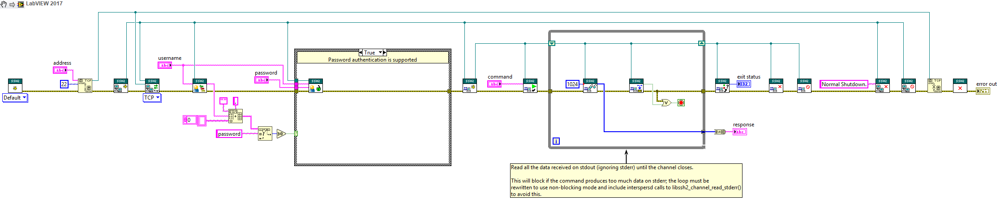

<!-- Based on https://github.com/othneildrew/Best-README-Template -->
<!-- PROJECT SHIELDS -->
<!--
*** I'm using markdown "reference style" links for readability.
*** Reference links are enclosed in brackets [ ] instead of parentheses ( ).
*** See the bottom of this document for the declaration of the reference variables
*** for contributors-url, forks-url, etc. This is an optional, concise syntax you may use.
*** https://www.markdownguide.org/basic-syntax/#reference-style-links
-->
[![Contributors][contributors-shield]][contributors-url]
[![Forks][forks-shield]][forks-url]
[![Stargazers][stars-shield]][stars-url]
[![Issues][issues-shield]][issues-url]
[![Build Status][azure-build-status-shield]][azure-build-status-url]
[![BSD-3-Clause License][license-shield]][license-url]

<!-- PROJECT LOGO -->
<br>
<p align="center">
  <a href="https://github.com/logmanoriginal/lvssh2">
    
  </a>

  <h3 align="center">lvssh2</h3>

  <p align="center">
    LabVIEW&trade; bindings for <a href="https://github.com/libssh2/libssh2">libssh2</a>.
    <br>
    <a href="https://github.com/logmanoriginal/lvssh2"><strong>Explore the docs »</strong></a>
    <br>
    <br>
    <a href="https://github.com/logmanoriginal/lvssh2">View Demo</a>
    <br>
    <a href="https://github.com/logmanoriginal/lvssh2/issues">Report Bug</a>
    <br>
    <a href="https://github.com/logmanoriginal/lvssh2/issues">Request Feature</a>
  </p>
</p>

## About The Project

**lvssh2** provides LabVIEW&trade; bindings for [libssh2](https://github.com/libssh2/libssh2).

See [libssh2-api](docs/libssh2-api.md) for API coverage.

### Limitations

> [!WARNING]
> Support for LabVIEW 64-bit is experimental and incomplete.

> [!NOTE]
> There is currently no built-in support for Linux and macOS.
> Users need to build the libssh2 shared library for these platforms themselves.

Although this project aims to provide complete bindings for libssh2, there are several limitations users need to be aware of:

- Buffer sizes are limited to 2^31-1 bytes (2 GiB) instead of 2^32-1 bytes (4 GiB). The reason for this is that arrays and strings in LabVIEW are limited to 2^31-1 elements. Additional limits may apply due to memory copies when calling external functions.
- This project includes an extension library to provide functionality that cannot otherwise be realized in LabVIEW. Callers can specify a conditional disable symbol `LVSSH2_NO_EXTENSIONS=True` to disable the extension library. When this conditional disable symbol is set, then all functions utilizing the extension library will turn into stubs.
- The public key subsystem is currently not implemented because of lack of support in OpenSSH and other major SSH servers. You can find more information at [ssh-publickeyd](https://github.com/grawity/ssh-publickeyd).

### Design Decisions

- **Error Handling**: This project uses the LabVIEW error handling mechanism. All functions return an error cluster that corresponds to a libssh2 error code (see [lvssh2-errors.txt](/lvssh2-errors.txt) and [lvssh2-sftp-errors.txt](/lvssh2-sftp-errors.txt)). See [libssh2-api](docs/libssh2-api.md) for a complete overview of error codes and how they are defined.
- **Length Parameters for String and Array types**: All functions that take a string or array type as an input parameter do not expose a separate length parameter. Instead, the length of the string or array is determined by the type itself. Because of this, some of the libssh2 convenience functions are not included. For example, `libssh2_channel_window_write` is not included because it would be equivalent to `libssh2_channel_window_write_ex`. For a complete overview of the functions that are included, see [libssh2-api](docs/libssh2-api.md).
- **Pointer Handling**: Pointers are not exposed to the caller. Instead, the caller receives a Refnum that represents a Data Value Reference which contains the pointer. This is done to provide a more LabVIEW-like interface and to avoid pointer handling for the caller. Note that this also ensures 32-bit and 64-bit compatibility.
- **Constants**: Constants are defined as enum typedefs in the lvssh2 library. This is done to provide a more LabVIEW-like interface. See [libssh2-api](docs/libssh2-api.md) for a complete overview of the constants and how they are defined.
- **Naming Conventions**: The naming conventions for the functions are based on the libssh2 function names.

### Built With

* [LabVIEW&trade;](https://www.ni.com/labview)
* [Visual Studio](https://visualstudio.microsoft.com)

## Getting Started

To get a local copy up and running follow these simple steps.

### Prerequisites

* LabVIEW&trade; 2013 or later
* Visual Studio 2022 or later (for building the extension library)
* VI Package Manager

### Installation

1. Clone the repo
   ```sh
   git clone https://github.com/logmanoriginal/lvssh2.git
   ```

## Usage

Here is an example that uses lvssh2 to execute a command on a remote SSH server.



## Roadmap

See the [open issues](https://github.com/logmanoriginal/labview-composition/issues) for a list of proposed features (and known issues).

## Further Reading

- [RFC4251](https://www.rfc-editor.org/rfc/rfc4251): The Secure Shell (SSH) Protocol Architecture
- [RFC4252](https://www.rfc-editor.org/rfc/rfc4252): The Secure Shell (SSH) Authentication Protocol
- [RFC4253](https://www.rfc-editor.org/rfc/rfc4253): The Secure Shell (SSH) Transport Layer Protocol
- [RFC4254](https://www.rfc-editor.org/rfc/rfc4254): The Secure Shell (SSH) Connection Protocol
- [RFC4819](https://www.rfc-editor.org/rfc/rfc4819): Secure Shell Public Key Subsystem

## Contributing

Contributions are what make the open source community such an amazing place to be learn, inspire, and create. Any contributions you make are **greatly appreciated**.

1. Fork the Project
2. Create your Feature Branch (`git checkout -b feature/AmazingFeature`)
3. Commit your Changes (`git commit -m 'Add some AmazingFeature'`)
4. Push to the Branch (`git push origin feature/AmazingFeature`)
5. Open a Pull Request

Keep in mind that LabVIEW&trade; VIs are binary files, which are difficult to merge.
- Only change a single VI or library.
- Avoid conflicts with other pull requests (don't work on the same libraries or VIs).
- Send VI Snippets (via issues) instead of pull requests when possible.

> [!NOTE]
> This project contains C++ code that is compiled into a shared library (see [extensions](/extensions/)). If you are familiar with C++ and want to contribute to the project, please consider contributing to the C++ code as well.

## License

Distributed under the BSD-3-Clause License. See [`LICENSE`](LICENSE.txt) for more information.

This project uses third-party libraries or other resources that may be distributed under different licenses. See [`THIRD-PARTY-NOTICES`](THIRD-PARTY-NOTICES.txt) for more information.

## Contact

Project Link: [https://github.com/logmanoriginal/lvssh2](https://github.com/logmanoriginal/lvssh2)

## Acknowledgements

* [libssh2](https://github.com/libssh2/libssh2)
* [Caraya Unit Test Framework](https://github.com/JKISoftware/Caraya)

<!-- MARKDOWN LINKS & IMAGES -->
<!-- https://www.markdownguide.org/basic-syntax/#reference-style-links -->
[contributors-shield]: https://img.shields.io/github/contributors/logmanoriginal/lvssh2.svg?style=for-the-badge
[contributors-url]: https://github.com/logmanoriginal/lvssh2/graphs/contributors
[forks-shield]: https://img.shields.io/github/forks/logmanoriginal/lvssh2.svg?style=for-the-badge
[forks-url]: https://github.com/logmanoriginal/lvssh2/network/members
[stars-shield]: https://img.shields.io/github/stars/logmanoriginal/lvssh2.svg?style=for-the-badge
[stars-url]: https://github.com/logmanoriginal/lvssh2/stargazers
[issues-shield]: https://img.shields.io/github/issues/logmanoriginal/lvssh2.svg?style=for-the-badge
[issues-url]: https://github.com/logmanoriginal/lvssh2/issues
[license-shield]: https://img.shields.io/github/license/logmanoriginal/lvssh2.svg?style=for-the-badge
[license-url]: https://github.com/logmanoriginal/lvssh2/blob/master/LICENSE.txt
[azure-build-status-url]: https://dev.azure.com/neuperger/Public/_build/latest?definitionId=21&branchName=main
[azure-build-status-shield]: https://img.shields.io/azure-devops/build/neuperger/public/21/main?style=for-the-badge&logo=azure-pipelines&label=Azure%20Pipelines
